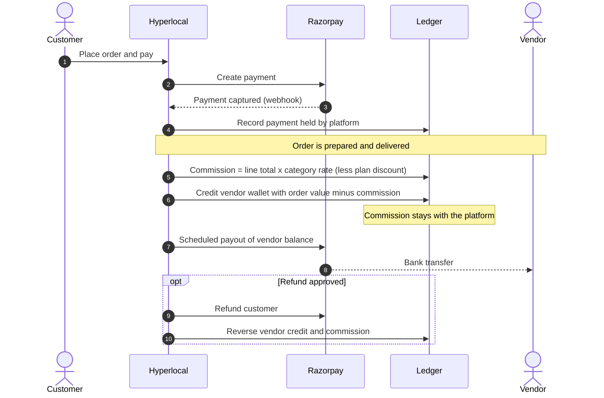

# Money flow

[Docs](../../README.md) / [Flows](../README.md) / [System](README.md) / Money flow

```mermaid
sequenceDiagram
    autonumber
    actor Customer
    participant Platform as Hyperlocal
    participant Gateway as Razorpay
    participant Ledger
    actor Vendor

    Customer->>Platform: Place order and pay
    Platform->>Gateway: Create payment
    Gateway-->>Platform: Payment captured (webhook)
    Platform->>Ledger: Record payment held by platform
    Note over Platform,Vendor: Order is prepared and delivered
    Platform->>Ledger: Commission = line total x category rate (less plan discount)
    Platform->>Ledger: Credit vendor wallet with order value minus commission
    Note over Ledger: Commission stays with the platform
    Platform->>Gateway: Scheduled payout of vendor balance
    Gateway-->>Vendor: Bank transfer
    opt Refund approved
        Platform->>Gateway: Refund customer
        Platform->>Ledger: Reverse vendor credit and commission
    end
```

