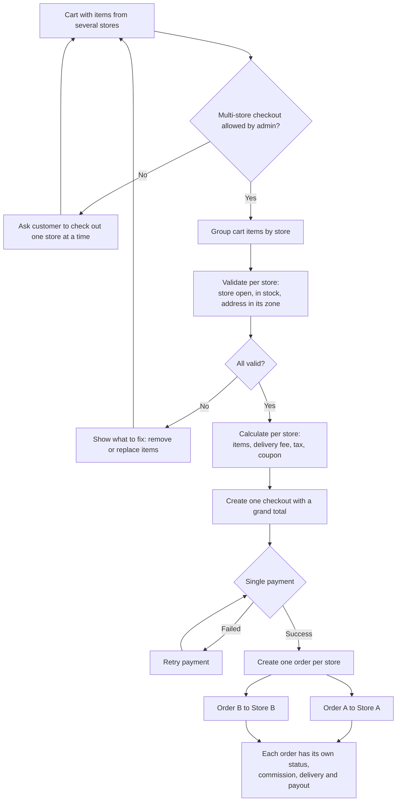

# Multi-store checkout

[Docs](../../README.md) / [Flows](../README.md) / [System](README.md) / Multi-store checkout

One cart and one payment become a separate order for each store.

```mermaid
flowchart TD
    cart["Cart with items from several stores"] --> allowed{Multi-store checkout allowed by admin?}
    allowed -->|No| single["Ask customer to check out one store at a time"]
    allowed -->|Yes| group[Group cart items by store]
    single --> cart
    group --> validate["Validate per store:<br/>store open, in stock, address in its zone"]
    validate --> ok{All valid?}
    ok -->|No| fix["Show what to fix: remove or replace items"]
    fix --> cart
    ok -->|Yes| totals["Calculate per store:<br/>items, delivery fee, tax, coupon"]
    totals --> checkout[Create one checkout with a grand total]
    checkout --> pay{Single payment}
    pay -->|Failed| retry[Retry payment]
    retry --> pay
    pay -->|Success| split[Create one order per store]
    split --> o1["Order A to Store A"]
    split --> o2["Order B to Store B"]
    o1 --> each["Each order has its own status,<br/>commission, delivery and payout"]
    o2 --> each
```

