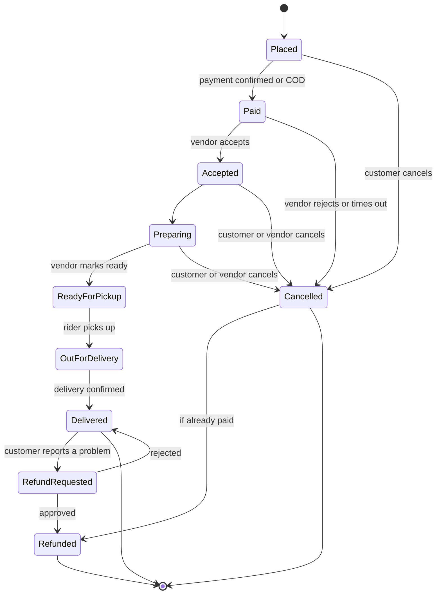

# Order lifecycle

[Docs](../../README.md) / [Flows](../README.md) / [System](README.md) / Order lifecycle

Each store's order moves through these states on its own.

```mermaid
stateDiagram-v2
    [*] --> Placed
    Placed --> Paid: payment confirmed or COD
    Paid --> Accepted: vendor accepts
    Accepted --> Preparing
    Preparing --> ReadyForPickup: vendor marks ready
    ReadyForPickup --> OutForDelivery: rider picks up
    OutForDelivery --> Delivered: delivery confirmed

    Placed --> Cancelled: customer cancels
    Paid --> Cancelled: vendor rejects or times out
    Accepted --> Cancelled: customer or vendor cancels
    Preparing --> Cancelled: customer or vendor cancels

    Cancelled --> Refunded: if already paid
    Delivered --> RefundRequested: customer reports a problem
    RefundRequested --> Refunded: approved
    RefundRequested --> Delivered: rejected

    Delivered --> [*]
    Refunded --> [*]
    Cancelled --> [*]
```

