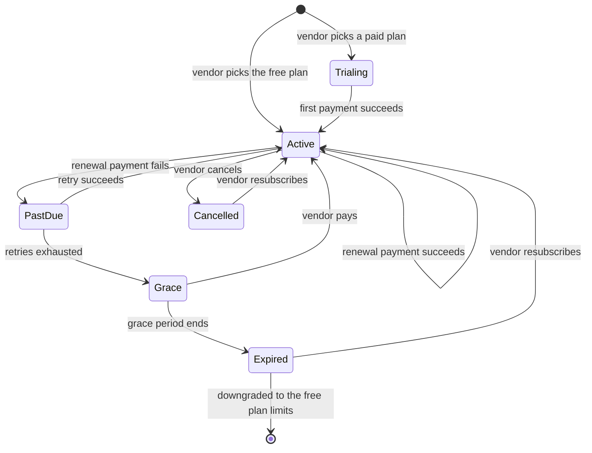

# Vendor subscription lifecycle

[Docs](../../README.md) / [Flows](../README.md) / [System](README.md) / Vendor subscription lifecycle

```mermaid
stateDiagram-v2
    [*] --> Trialing: vendor picks a paid plan
    [*] --> Active: vendor picks the free plan
    Trialing --> Active: first payment succeeds
    Active --> Active: renewal payment succeeds
    Active --> PastDue: renewal payment fails
    PastDue --> Active: retry succeeds
    PastDue --> Grace: retries exhausted
    Grace --> Active: vendor pays
    Grace --> Expired: grace period ends
    Active --> Cancelled: vendor cancels
    Expired --> Active: vendor resubscribes
    Cancelled --> Active: vendor resubscribes
    Expired --> [*]: downgraded to the free plan limits
```

